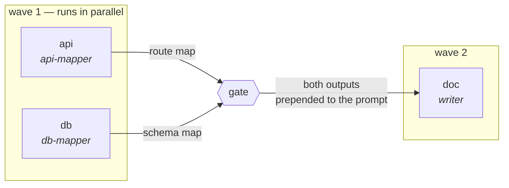
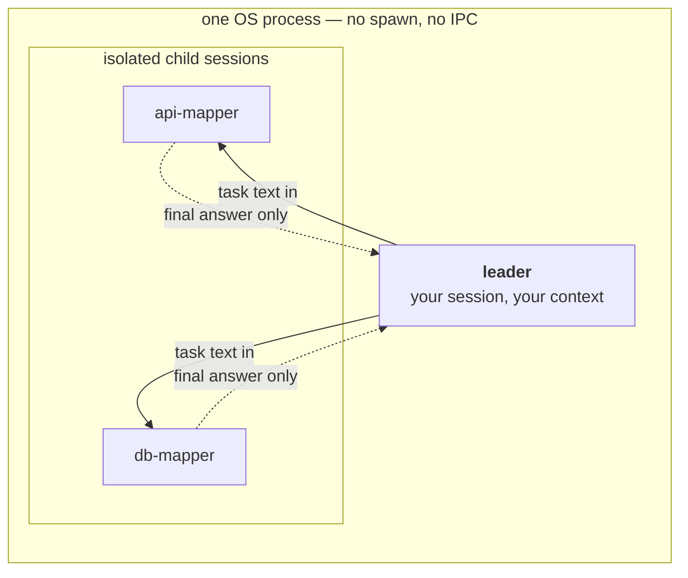
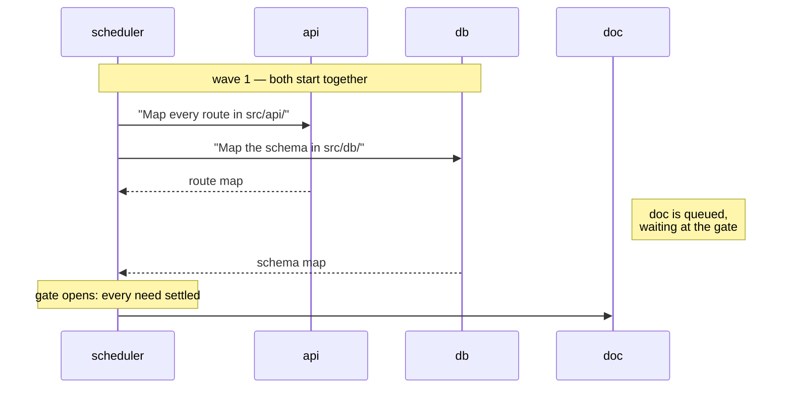
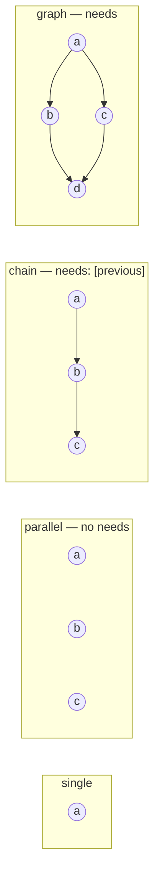
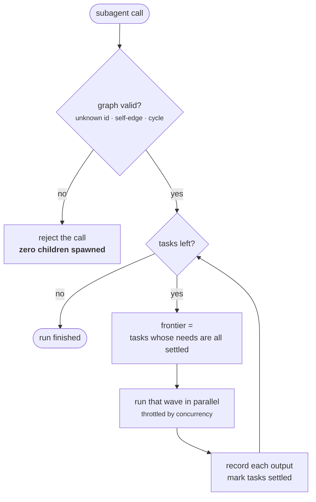
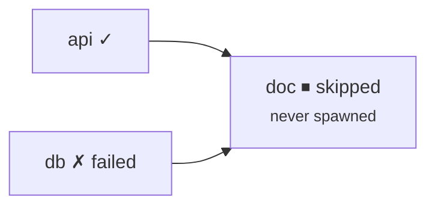
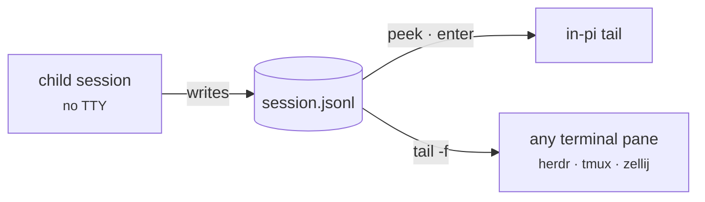
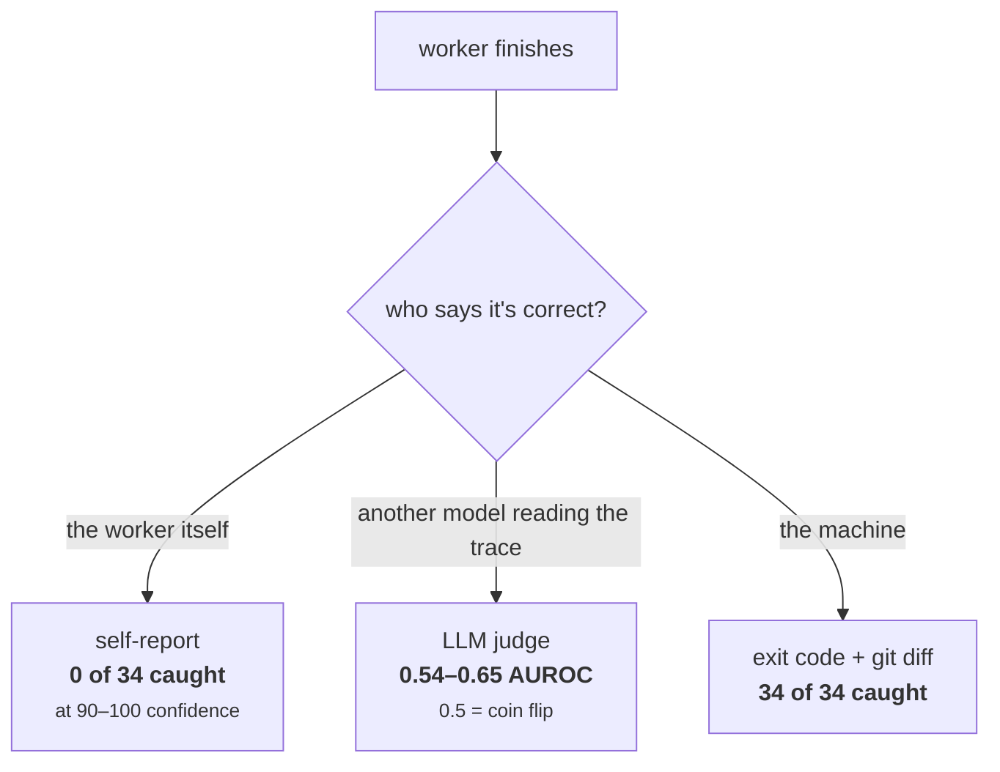

# @arhen/pi-core-subagent

[](https://www.npmjs.com/package/@arhen/pi-core-subagent)
[](https://github.com/arhen/pi-core-subagent/actions/workflows/ci.yml)
[](./LICENSE)
[](https://github.com/earendil-works/pi)

## Install

Requires the [pi coding agent](https://github.com/earendil-works/pi) — install it first: `npm install -g @earendil-works/pi-coding-agent`.

```sh
pi install npm:@arhen/pi-core-subagent
# or locally: pi install /path/to/pi-subagents
```

Minimalist pi extension: **fast in-process subagents** with single / parallel / graph modes, background runs, cancellation, intercom (child↔leader) and an agent↔agent mailbox.

Built for one job: delegate work to isolated subagents **without bloating the parent context**.

One rule underneath everything else:

> **A task is a graph, not a checklist.** Nodes are workers, edges are data dependencies. The edge both gates the dependent *and* hands it the upstream output — so "the coordinator forgot to pass X" stops being a failure mode. Where there are no edges, there is no graph: flat fan-out stays flat.

That is [Graph Protocol](#graph-protocol), applied to the runtime rather than to the prompt.




*The `subagent` tool call plus the live above-editor widget: per-agent activity, tool counts, turns, token counters and timers.*

## Design principles

- **The delegation is the graph.** `needs` declares edges; the scheduler runs each wave of ready tasks in parallel and gates the rest. One code path for single, parallel, chain and graph — `chain` is just `needs: [previous]`. ([why](#why-waves-instead-of-more-agents))
- **Edges carry data, not just order.** An upstream task's output is prepended to its dependents' prompts automatically. The coordinator cannot forget to pass it, because it never passes it.
- **A bad graph fails before it spawns.** Unknown ids, self-edges and cycles are rejected at call time — never halfway through a run with three children already burning tokens.
- **Proof is an exit code, never a self-report.** Tasks are asked for a runnable `Verify:` command; the leader checks `git diff --stat`. Agents auditing their own work score ~0. ([why](#why-9-is-a-verification-command-not-a-self-report))
- **No ceremony without edges.** Six independent reviewers stay six independent reviewers — no waves, no gates, no graph vocabulary imposed on flat work.
- **Agent files respected.** A spawn goal (name + task) that matches a user agent file's `description` (`.agents/agents`, `.claude/agents`, `.pi/agents` — project then home) loads that file — body = system prompt, frontmatter `model`/`tools` apply, file `model` validated against the pi model registry. File wins over inline; no match → on-demand definition.
- **Two toolsets, plus explicit override — stated, never defaulted.** Read-only (`read, grep, find, ls` — `write: false`) or write (`read, grep, find, ls, bash, edit, write` — `write: true`); `tools:` sets an explicit per-task allowlist. A task that states none of the three is **refused at call time**; there is no default toolset.
- **In-process** — children are `AgentSession`s in the same runtime. No process spawn, no context bleed.
- **Zero parent-context injection.** No catalog, no context hook. 10 slim tools total.
- **Throttled updates** — widget/stream updates coalesce to ~6/s; no per-event deep clones.
- **Bounded always** — a child is limited only by wall clock: explicit `maxRuntimeMs`, else the 1 h ceiling with `/subagents auto-limit on`, else the 6 h safety ceiling (default).

## How it runs

Children are not subprocesses. They are separate `AgentSession`s inside the same pi process — which is why spawning is instant, and why a child's transcript never lands in your context:



The dotted arrows are the whole point: a child may burn 200k tokens reading files, and the leader receives only its final answer.

## Usage — the leader invents the agents

Define agents inline per call, or reference a named agent file (see [Agent files](#agent-files)). Model resolution: agent-file `model` → explicit `model` → **rejected** (a matched agent file wins, so its frontmatter overrides the inline value). There is no default model: a task that names neither is a hard error, so every task states its model choice rather than silently inheriting the leader's. Call `subagent_models` for the models enabled in this session (or every available model when Pi has no scope).

```json
{
  "agent": "api-reviewer",
  "prompt": "You are a strict API reviewer. Check auth, rate limiting, and error handling. Cite file:line.",
  "model": "anthropic/claude-sonnet-4-6",
  "write": false,
  "task": "Review src/api/upload.ts"
}
```

Parallel — mixed toolsets, siblings can talk via mailbox (intercom is always on):

```json
{
  "tasks": [
    { "agent": "researcher", "prompt": "You find facts. Cite paths.", "task": "Map the auth flow", "write": false, "model": "anthropic/claude-sonnet-4-6" },
    { "agent": "implementer", "prompt": "You make minimal changes.", "task": "Implement POST /api/upload", "write": true, "model": "anthropic/claude-sonnet-4-6" }
  ]
}
```

Chain — `{previous}` is replaced with the prior agent's output:

```json
{
  "chain": [
    { "agent": "planner", "prompt": "You write a step list.", "task": "Plan the change", "write": false, "model": "anthropic/claude-sonnet-4-6" },
    { "agent": "doer", "prompt": "You follow the plan exactly.", "task": "Execute: {previous}", "write": true, "model": "anthropic/claude-sonnet-4-6" }
  ]
}
```

## Model catalog advice (optional)

`~/.pi/agent/subagent-models.json` may add user-owned guidance to `subagent_models`:

```json
{
  "default": "provider/model-id",
  "note": "Choose a lower-cost model for routine work. Use a higher-cost model only when explicitly requested."
}
```

- `default` appears only when that exact reference is enabled in the current Pi session.
- `note` appears verbatim beside the model list.

Both fields are advisory. They never change Pi's enabled set and never supply a task's required `model`.

## Agent files

A user agent file in an agents directory is matched by its `description` frontmatter against the spawn goal (`agent` name + `task`) — not by name. When matched, the file is **authoritative**: body = system prompt, frontmatter `model`/`tools` apply, inline `prompt`/`model` are ignored — with one exception: explicit per-call `tools`/`write` override the file's tools (the file supplies the default for that task, it never displaces explicit intent, and it can never widen past the leader's read/write choice). A file's `tools` frontmatter **satisfies the tool-allowance gate**, so a task that matches such a file need not repeat the allowance inline. An override is surfaced on the task's notice and summary. No match → the inline on-demand definition stands, and the inline task must then state its own allowance. The model stays in control: it names the agent and states the goal; user files that describe that goal take over.

```md
---
name: api-reviewer
description: reviews APIs for auth, rate limiting, and error handling
model: claude-opus-4-6
tools: read, grep, find, ls
---
You are a strict API reviewer. Check auth, rate limiting, and error handling. Cite file:line.
```

**Lookup order** (first directory with a match wins):

1. `.agents/agents/` then `.claude/agents/` then `.pi/agents/` in each directory from the task `cwd` up to the filesystem root (nearest ancestor wins).
2. Home: `~/.agents/agents/` (single source) → `~/.claude/agents/` → `~/.pi/agents/`.

Within a directory the file with the highest description-overlap score wins (≥2 shared meaningful tokens). A file `model` is validated against the pi model registry; an unknown one fails the task with the registry's message (call `subagent_models` for the enabled references (or every available reference when Pi has no scope)). Files without a `description` frontmatter never match.

## Worktree isolation (write agents)

In a git repo, a `write: true` subagent runs in an **isolated git worktree** at `<repo>/.git/subagents/<run>/<task>` on branch `subagents/<run>/<task>` — the child's cwd is the worktree, so project context (AGENTS.md chain) still loads, `node_modules` is symlinked, and the main tree stays clean while the child works. Parallel write agents can't collide on files.

On completion the extension commits the child's changes (the child is told not to touch branches) and reports **branch + diffstat + changed files** in the result. The leader reviews, then merges:

```
git merge --no-ff subagents/<run>/<task>
```

**Branch relationships — read this before merging.** A write task that `needs` a completed write task is **stacked**: its worktree branches from the upstream's branch, so the child actually sees the files its upstream wrote. A stacked branch *contains* its upstream's commits, so merge order doesn't matter — merging the stacked branch brings both, and the upstream's own merge is then a no-op.

Why this matters (verified against real git, not just reasoned about): when a downstream child *can't* see its upstream's work, merging produces spurious conflicts, half-clobbered files where the child's side looks like a phantom delete, and — worst — **clean merges that leave a broken tree**. If the upstream renamed `login`→`signIn` and the downstream wrote new code importing `login`, git reports success with exit 0 and the code doesn't compile. Stacking removes that class by construction.

Same-wave write tasks are **siblings**: both branch from the same base, so they are independent. When two siblings changed the same file the summary emits `CONFLICT RISK` naming the overlap — the second `git merge` is a real 3-way and fails loudly, which is the safe outcome. The dangerous case is siblings touching *different* but coupled files: that merges clean and breaks at runtime. Nothing can detect it for you.

**Dependencies are shared, not isolated.** `node_modules` is symlinked to the main checkout, so dependency writes escape the worktree: children are instructed never to install, upgrade, or delete deps. A task that genuinely needs a dependency change should edit the manifest and say so.

Isolation follows the toolset the child actually receives: explicit `tools: ["bash", "edit", "write"]` earns a worktree even without `write: true`, and an agent file that narrows the child to read-only gets no branch at all. Because the toolset is now always stated, whether a task gets a worktree is a decision the leader made rather than one inferred from silence.

Cleanup, in order of trust:

| When | What |
|---|---|
| Session start | Registered worktrees can't be live yet — an interrupted child's uncommitted work is committed, the branch kept, the dir dropped. Then merged branches are reaped and dirs git no longer tracks are removed. |
| After a run | Merged branches + their dirs, never touching a branch a live run owns (checkout state re-checked per branch). |
| Task failed/canceled | Partial work is committed first, so the branch keeps it; the dir is dropped. |

Non-git repos fall back to in-place edits.

## Graph mode — `needs`

`parallel` runs everything at once; `chain` runs everything one at a time. Most real work is neither. Give a task an `id` and list the ids it `needs`:

```json
{
  "tasks": [
    { "id": "api", "agent": "api-mapper", "task": "Map every route in src/api/", "write": false, "model": "anthropic/claude-sonnet-4-6" },
    { "id": "db",  "agent": "db-mapper",  "task": "Map the schema in src/db/", "write": false, "model": "anthropic/claude-sonnet-4-6" },
    { "id": "doc", "agent": "writer", "needs": ["api", "db"], "write": true, "model": "anthropic/claude-sonnet-4-6",
      "task": "Write ARCHITECTURE.md from the maps above. Verify: test -s ARCHITECTURE.md" }
  ]
}
```

The call line renders the graph in §2 notation as the model types it:

```
subagent graph 3
  6 at a time
  wave1[api ∥ db] → gate → wave2[doc]
  api api-mapper Map every route in src/api/
  db  db-mapper Map the schema in src/db/
  doc writer ✎ ← api, db Write ARCHITECTURE.md from the maps above. Verify: test -s ARCHI…
```

`✎` marks a write-toolset task; `←` lists its edges. With no `needs` anywhere the wave line is omitted entirely.

### What one edge does

An edge is not just ordering. It is a delivery:



The leader never copies those outputs into the prompt — so it cannot forget to.

### One scheduler, four shapes

Single, parallel, chain and graph are not four code paths. They are four shapes of the same wave loop:



### The loop



Two consequences worth stating plainly:

- **A bad graph costs nothing.** Validation happens before the first spawn, never halfway through with three children already burning tokens.
- **A broken upstream stops its branch.** If a need fails or is aborted, its dependents are marked aborted rather than run against a prompt with a hole in it:



And the rule that keeps this from becoming ceremony: **zero `needs` anywhere = plain parallel.** No waves, no gates, no graph vocabulary imposed on flat work.

Background (default) + intercom — the run returns a runId immediately; you stay steerable while it works. Children can always ask you questions and message each other:

```json
{
  "agent": "auditor",
  "prompt": "You audit dependencies.",
  "model": "anthropic/claude-sonnet-4-6",
  "write": false,
  "task": "Audit package.json for outdated deps"
}
```

**Steering a running child:** while a background run is active the leader stays responsive, and you can push a message into a live child's session mid-run with `steer_subagent` — e.g. `steer_subagent({ runId, taskId, message: "Ignore tests/, only audit runtime deps" })`. The message queues as a steer if the child is mid-turn and lands at its next model boundary. Omit `taskId` to steer every still-running task in the run. Combined with `notifyPerTask`, this makes a background run feel like a live team you can redirect, not a fire-and-forget blob.

**Continuing a child:** `resume_subagent({ runId, taskId, message?, model? })` reopens the same child session JSONL, including its prior conversation and any compaction summary. A completed child requires a new `message` describing the next work; a failed or aborted child can omit it to recap and retry. The same run/task receives the latest result, the recorded tool allowance is reused, and completed dependents are not rerun. The tool works after reopening the same saved parent Pi session, provided its sidecar and the child's session file still exist. It never imports a child from another parent session. Wait for the run to settle before continuing. For a worktree-isolated write task, the original unmerged branch must still exist; if it was merged or deleted, continuation is refused rather than falling back to in-place edits. A task that originally ran in place continues in its recorded directory. `model` may change providers, but the existing model and thinking level remain selected when no override is given. Compaction and the selected model's finite context limit still apply.

## Tools

| Tool | Purpose |
|---|---|
| `subagent_models` | list models enabled for the session (or every available model when Pi has no scope), each with the exact `model` value, thinking levels, context window, Pi catalog pricing, and optional user-owned catalog advice; call it before the first spawn and after a rejection |
| `subagent` | single / `tasks` (parallel or graph via `needs`) / `chain` (`{previous}`); every run is background — returns a runId, completion notifies you; `autoAwait:true` parks the call until the run finishes and returns the final result inline; children always carry talk tools (ask/notify/mailbox); `notifyPerTask` (default true) wakes you as each task completes |
| `subagent_status` | live per-task snapshot (non-blocking), including each child's session file path |
| `subagent_result` | full output of a run or one task |
| `await_subagent` | block until a run finishes (optional `timeoutMs`) |
| `reply_subagent` | answer a child's `ask_parent` question |
| `steer_subagent` | inject a steering message into a running child's session (queues as steer if mid-turn; lands at its next model boundary) |
| `resume_subagent` | continue a settled task in its original session; completed tasks need a new `message`, failed/aborted tasks can use the default retry prompt |
| `subagent_cancel` | abort a running/queued run |

### Per-task fields

`agent` (name you invent — required), `task` (required), `model` (required unless an agent file declares one — see below), `prompt` (system prompt, optional — minimal default used), an explicit **tool allowance** (`write: true`, `write: false`, or `tools: [...]` — required unless an agent file supplies `tools`; see below), plus optional `thinking` (validated enum: `off|minimal|low|medium|high|xhigh|max`), `cwd`, `maxRuntimeMs`, `id`, `needs` (dependency edges — see [Graph mode](#graph-mode--needs)). Top-level only: `autoAwait`, `notifyPerTask`, `concurrency`.

### Tool allowance is required

Every task must state what its child may do. There is no default toolset and no fallback:

| Form | Toolset |
|---|---|
| `write: false` | read-only — `read, grep, find, ls` |
| `write: true` | write — `read, grep, find, ls, bash, edit, write` |
| `tools: ["read", "bash"]` | exactly that list |
| agent file `tools:` frontmatter | that list, when the file is matched |

A task that states none of these is rejected before any child starts. A single offender is named with the three forms; several are listed together under a `No tool allowance stated for N tasks:` header, so one call reports every task the leader must fix. An empty `tools: []` is refused too — it grants nothing, so it is silence wearing a list.

Two reasons this is a gate rather than a default. A silent read-only child is the expensive case: it cannot run the `Verify:` command every task is asked for, so the failure surfaced only after a full spawn, as a child reporting itself blocked. And the child's toolset decides whether it earns a worktree — an implicit read-only made that a guess rather than a decision.

The refusal for toolset is reported **after** the model refusals, so a spawn wrong about both is told about its model first and its toolset on the retry. Both checks collect every offender in one pass: a run with three modelless tasks names all three rather than making the leader retry per task.

### Child talk tools (always on)

| Tool | Meaning |
|---|---|
| `ask_parent` | blocking question to the leader; parent answers via `reply_subagent` |
| `notify_parent` | one-way message to the leader |
| `send_agent_message` | message to a sibling subagent's mailbox (`to` = its task id, or `"leader"`) |
| `poll_agent_messages` | drain this subagent's mailbox |

> **Intercom anti-deadlock:** children are told to never block indefinitely on intercom replies — an unanswered `ask_parent` times out after 10 minutes (the child is told to proceed with best judgment), and sibling polls are capped (~5 tries) with the same fallback. Gated siblings (later waves) may not be running yet — waiting on them is the top stall cause, so children are instructed not to.

## Commands

- `/subagents` — list runs; `/subagents peek` (or `ctrl+shift+a`) — browsable pane
- `/subagents auto-limit on|off` — toggle leader-imposed `maxRuntimeMs` caps (persists to `~/.pi/agent/subagents-config.json`; default **off**). `on` gives tasks without an explicit `maxRuntimeMs` the 1 h default ceiling; `off` raises the ceiling to 6 h (still a ceiling — an unbounded child would pin the run forever). Bare `/subagents auto-limit` shows the current state.

## Peek — `/subagents peek` or `ctrl+shift+a`

Read-only pane over the session's subagents:

- `shift+↑`/`shift+↓` (or `j`/`k`) — move between agents; bare arrows work too where the terminal doesn't reserve them
- `enter` — live tail of that child's session file (`esc` goes back)
- `x` then `y` — abort ONE subagent (only mutation; `n`/any other key cancels)
- `esc` — close

## Watching a child from outside

A child has no terminal of its own — but it does write a real transcript file, and that file is the seam every external viewer can use:



`subagent_status` returns that path for every running child:

```sh
tail -f /path/from/subagent_status.jsonl
```

In a terminal multiplexer, that is a pane per agent — e.g. with [Herdr](https://herdr.dev):

```sh
herdr pane split --current --direction right
herdr pane run w1:p2 "tail -f /path/from/subagent_status.jsonl"
```

The extension has no multiplexer integration and does not want one: it exposes the path, your agent already knows how to drive its own terminal. For an in-pi view of the same stream, use [`/subagents peek`](#peek--subagents-peek-or-ctrlshifta).

## Context budget

- Parent tools: 10 schemas with short descriptions. **No catalog, no context hook** — nothing injected per request.
- Background completion: 3-line notice. Full text only via `subagent_result`.
- Children: isolated sessions; talk tools always injected; each child's prompt states its own task id and its siblings' so mailbox addressing works. Model resolution: agent-file `model` → explicit `provider/model-id` or bare id via the pi model registry → otherwise the task fails. No default is applied, so delegating never silently picks a model on the caller's behalf. Thinking levels validated against the levels the runtime actually honors (`getSupportedThinkingLevels`), so a level the catalog lists is never silently clamped.

## What this is built on

### Graph Protocol
<a id="graph-protocol"></a>

`needs` is an implementation of [Graph Protocol](https://gist.github.com/r17x/90eb2f7be93932b5693753aedb09c01a) — a delegation discipline that treats a task as a graph (`Delegation<A, E, R>`) rather than a checklist. Its ten sections map onto this extension as follows:

| § | Protocol | Here |
|---|---|---|
| §1 | nodes, domains, edges | one `agent` owns one task; `needs` are the edges |
| §2 | happy path as execution graph, waves + gates | wave scheduler: `ready = tasks whose needs are settled` |
| §3 | one worker or many | `single` vs `tasks` |
| §4 | break points: wrong context, **missing input**, misinterpretation | missing input is structurally impossible — the edge carries the output |
| §5 | R: subgraph, method, **verification command**, WHY | prompt guidelines require a runnable `Verify:` line per task |
| §6 | structured at the boundary | in: upstream outputs prepended as named blocks. out: prose (see below) |
| §7 | observe without changing the graph | the widget and `/subagents peek` are read-only |
| §8 | worker attention acquired and released | spawn → terminal status; aborted upstream releases dependents immediately |
| §9 | prove it: delegated vs implemented | **deliberately not self-reported** — see below |
| §10 | prompt = subgraph, return = implemented graph | prompt yes; return kept as prose |

### Why §9 is a verification command, not a self-report

The protocol asks the coordinator to compare the delegated subgraph against the graph the worker says it implemented. We implement the comparison against **the filesystem and the exit code**, not against the worker's account of itself, because self-reports carry close to zero signal about exactly the failure §9 exists to catch:

- Asked to audit its own work against 34 real violations, an agent reported **0** — at 90–100 confidence. A *fresh* instance of the same model shown the same output caught 7 (p = 0.0156). A deterministic checker caught all 34. ([Armalo Labs, 2026](https://www.armalo.ai/labs/research/2026-06-11-zero-bit-self-audit))
- Across 9,876 τ2-bench and 1,879 AppWorld trajectories, "false success" reached **75.8%** of self-assessing coding-agent failures; adding an LLM judge scored **0.54–0.65 AUROC** (0.5 = coin flip). ([arXiv:2606.09863](https://doi.org/10.48550/arxiv.2606.09863))
- LLM judges reading agent traces can be flipped by rewriting the trace — the exact surface a self-reported graph exposes. ([arXiv:2601.14691](https://arxiv.org/html/2601.14691))

The shape of the problem:



So §9 in practice is two things you already have:

```sh
# in the task text — the worker must prove it, not claim it
Verify: npx tsc --noEmit && bun test

# in the leader, after the run — ground truth, not narrative
git diff --stat
```

If files outside a worker's subgraph were touched, the diff says so. A structured return schema would only add a second, less trustworthy witness.

### Why waves instead of "more agents"

Flat fan-out is not free — orchestration cost is `critical path + α × cross-agent communication`, and ignoring the second term is what makes added agents *lose* to a single one:

- Dependency-graph partitioning vs flat file-parallel spawning across 28 real repos: **+14.0% pass rate, 2.10× wall-clock, −35% API cost**, with the largest gains on the most dependency-dense projects. Flat parallel inflated cost 60% for a 1.56× speedup; an agent-team baseline was fastest but scored *below sequential* on code quality. ([arXiv:2606.00953](https://arxiv.org/html/2606.00953v1))
- Dynamic task graphs across 300 trials: 47.5% of baseline token cost, 79.7% accuracy vs 57.6% for a static graph — and, notably, **static tied dynamic when the structure was genuinely known up front**, which is the case `needs` targets. The "frontier" (ready set) in this scheduler is theirs. ([arXiv:2605.06320](https://arxiv.org/html/2605.06320))

The corollary is in the design principles: when there are no edges, don't draw a graph. Six independent reviewers stay six independent reviewers.

## Development

```sh
bun install        # dev deps (typecheck/test only; runtime uses pi's bundled SDK)
npx tsc --noEmit
bun test           # pure-logic tests (wave scheduling, edge payload, mailbox, failure classification, watchdog)
```

Runtime state: runs persist to `<parent-session>.subagents.json` sidecar; restored (non-terminal → aborted) on session start.

## License

MIT.
